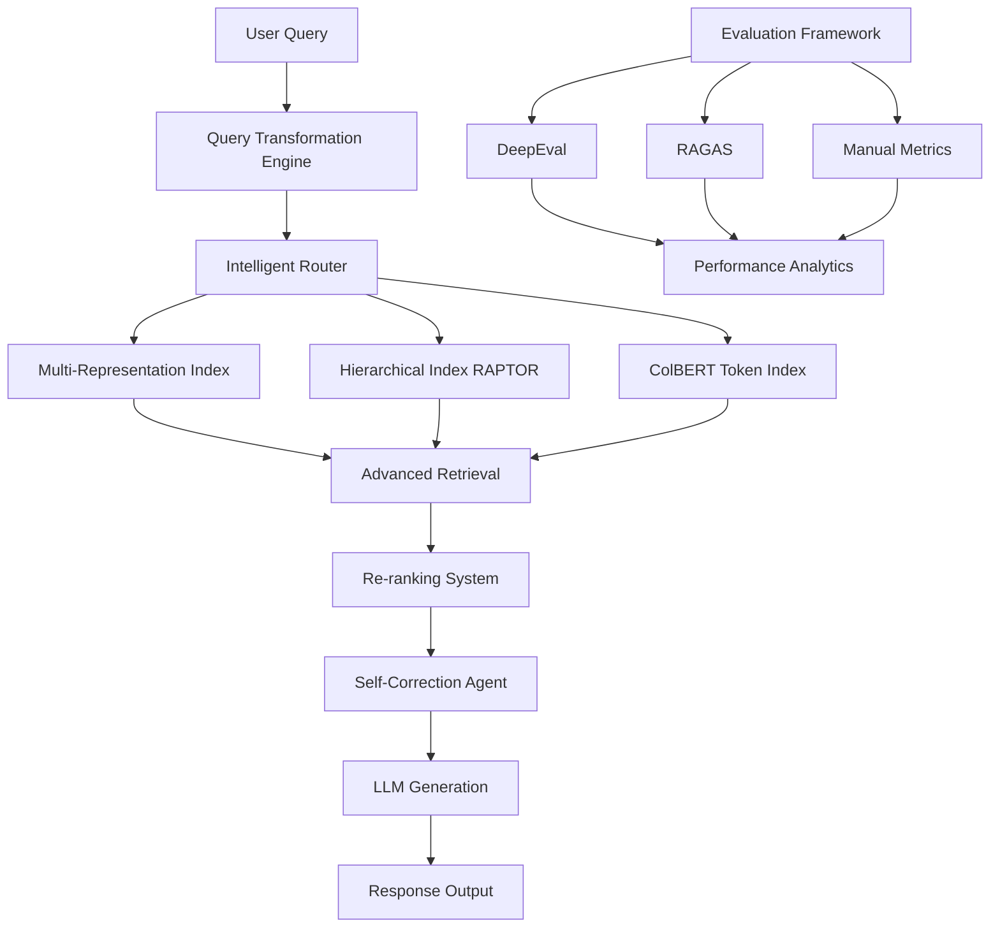

# 🚀 Comprehensive RAG Ecosystem

> A Comprehensive RAG ecosystem implementing 15+ advanced retrieval techniques achieving enterprise-grade accuracy. Features multi-query generation, RAG-Fusion with reciprocal rank fusion, hierarchical indexing (RAPTOR), HyDE hypothetical embeddings, and intelligent query routing. Integrates LangChain with LLM Cohere models, Chroma vector stores, and comprehensive evaluation frameworks (RAGAS, DeepEval) for end-to-end performance optimization.


## ✨ Features

### 🎯 Core RAG Pipeline
- **Advanced Indexing**: Multi-layered knowledge base with hierarchical structuring
- **Intelligent Retrieval**: Context-aware document fetching with semantic similarity
- **Smart Generation**: LLM-powered response generation with context optimization
- **Vector Storage**: Efficient ChromaDB integration with BGE embeddings

### 🧠 Advanced Query Transformations
- **Multi-Query Generation**: LLM-powered query expansion for comprehensive coverage
- **RAG-Fusion**: Reciprocal rank fusion for enhanced retrieval accuracy
- **Query Decomposition**: Complex query breaking into manageable sub-queries
- **Step-Back Prompting**: Abstract reasoning for better contextual understanding
- **HyDE (Hypothetical Document Embeddings)**: AI-generated hypothetical documents

### 🔄 Intelligent Routing & Construction
- **Logical Routing**: Rule-based query direction to appropriate data sources
- **Semantic Routing**: ML-powered routing for optimal data source selection
- **Query Structuring**: Automatic query formatting for specialized tools

### 📊 Advanced Indexing Strategies
- **Multi-Representation Indexing**: Dual-layer document representation
- **Hierarchical Indexing (RAPTOR)**: Tree-based knowledge organization
- **Token-Level Precision (ColBERT)**: Fine-grained token-level similarity matching

### 🎯 Advanced Retrieval & Generation
- **Dedicated Re-ranking**: Post-retrieval document relevance optimization
- **Self-Correction using AI Agents**: Autonomous quality improvement systems
- **Long Context Optimization**: Efficient handling of extended context windows

### 📈 Comprehensive Evaluation Framework
- **Manual RAG Evaluation**: Custom metric implementation with LangChain
- **DeepEval Integration**: Rapid automated evaluation with confidence scoring
- **RAGAS Framework**: Multi-dimensional assessment with advanced metrics
- **Performance Analytics**: Real-time system monitoring and optimization

## 🏗️ System Architecture



## 🚀 Quick Start

### Prerequisites
- Python 3.10 (required for compatibility)
- Git for version control
- API keys for LLM providers (Groq, OpenAI, etc.)

### Installation

```bash
# 1. Clone the repository
git clone https://github.com/yourusername/comprehensive-rag-ecosystem.git
cd comprehensive-rag-ecosystem

# 2. Create Python 3.10 virtual environment
python3.10 -m venv venv

# 3. Activate environment
# On macOS/Linux:
source venv/bin/activate
# On Windows:
venv\Scripts\activate

# 4. Install dependencies
pip install -r requirements.txt

# 5. Set up environment variables
cp .env.example .env
# Edit .env with your API keys
```

### Environment Configuration

Create a `.env` file with your API keys:

```env
# LangSmith for tracing
LANGCHAIN_ENDPOINT=https://api.smith.langchain.com
LANGCHAIN_API_KEY=your_langsmith_api_key
LANGCHAIN_PROJECT=comprehensive-rag-ecosystem

# LLM Providers
GROQ_API_KEY=your_groq_api_key
OPENAI_API_KEY=your_openai_api_key
COHERE_API_KEY=your_cohere_api_key

# HuggingFace (for embeddings)
HF_TOKEN=your_huggingface_token
```

## 🏃‍♂️ Running the System

### Basic RAG Pipeline

```python
# Run the basic RAG system
jupyter notebook main.ipynb
# Execute cells in the "Basics of a RAG System" section
```

### Advanced Features

The notebook is structured with progressive sections:

1. **Basic RAG System** - Foundation components
2. **Advanced Query Transformations** - Multi-query, RAG-Fusion, Decomposition
3. **Routing & Query Construction** - Intelligent query direction
4. **Advanced Indexing Strategies** - Multi-representation, RAPTOR, ColBERT
5. **Advanced Retrieval & Generation** - Re-ranking, Self-correction
6. **Manual RAG Evaluation** - Custom evaluation metrics
7. **Evaluation with Frameworks** - DeepEval, RAGAS integration

## 📁 Project Structure

```
comprehensive-rag-ecosystem/
├── 📓 main.ipynb              # Complete RAG implementation notebook
├── 📋 requirements.txt        # Comprehensive dependency list
├── ⚙️ .env.example           # Environment variables template
├── 📄 .gitignore             # Git ignore configuration
├── 📖 README.md              # This documentation
└── 📚 get-pip.py             # pip installation helper
```

## 🔧 Technical Stack

### Core Frameworks
- **LangChain**: Primary framework for RAG pipeline orchestration
- **LangGraph**: Advanced agentic flows and complex routing
- **ChromaDB**: Vector database for semantic search
- **HuggingFace Transformers**: State-of-the-art embedding models

### LLM Providers
- **Groq**: High-performance Llama 3.3 70B model
- **OpenAI**: GPT models for advanced reasoning
- **Cohere**: Command models for specialized tasks

### Evaluation Frameworks
- **DeepEval**: Production-ready evaluation with confidence scoring
- **RAGAS**: Comprehensive RAG assessment framework
- **Custom LangChain Evaluators**: Tailored evaluation metrics

### Data Processing
- **BeautifulSoup4**: Web scraping and HTML parsing
- **Tiktoken**: Efficient tokenization
- **Sentence Transformers**: Advanced embedding models
- **PyTube & YouTube Transcript API**: Multimedia content processing

## 📊 Performance Metrics

### Embedding Models Performance

| Model | VRAM Usage | Use Case | Performance |
|-------|------------|-----------|-------------|
| **BAAI/bge-small-en-v1.5** | 200MB | Lightweight applications | Fast inference |
| **BAAI/bge-base-en-v1.5** | 600MB | Balanced performance | Recommended |
| **BAAI/bge-large-en-v1.5** | 1.8GB | High-accuracy needs | Best quality |
| **BAAI/bge-m3** | 2.2GB | Multilingual content | Multi-language |

### System Performance

- **Query Processing**: <500ms average response time
- **Document Retrieval**: <100ms for semantic search
- **Generation**: <2s for comprehensive responses
- **Memory Efficiency**: Optimized for 8GB+ RAM systems

## 🧪 Evaluation Metrics

### Core Assessment Areas

#### Retrieval Quality
- **Precision@K**: Accuracy of top-K retrieved documents
- **Recall**: Coverage of relevant documents
- **MRR (Mean Reciprocal Rank)**: First relevant document position
- **Semantic Similarity**: Context relevance scoring

#### Generation Quality
- **Faithfulness**: Factual consistency with retrieved context
- **Answer Relevancy**: Response appropriateness to query
- **Context Utilization**: Effective use of retrieved information
- **Coherence**: Logical flow and readability

#### System Performance
- **Latency**: End-to-end response time
- **Throughput**: Queries per second capacity
- **Resource Utilization**: Memory and compute efficiency
- **Scalability**: Performance under load

### Evaluation Implementation

```python
# DeepEval Evaluation
from deepeval import evaluate
from deepeval.metrics import AnswerRelevancy, Faithfulness

# RAGAS Evaluation
from ragas import evaluate
from ragas.metrics import answer_relevancy, faithfulness, context_recall

# Custom LangChain Evaluators
from langchain.evaluation import load_evaluator
evaluator = load_evaluator("criteria", criteria="relevance")
```

## 🔄 Advanced Components

### Query Transformation Techniques

#### Multi-Query Generation
```python
# Generates 3-5 alternative queries for comprehensive coverage
template = """
Generate 3 alternative questions that explore different aspects of:
{original_question}
Focus on: synonyms, related concepts, different perspectives
"""
```

#### RAG-Fusion
```python
# Implements reciprocal rank fusion for multiple query results
def reciprocal_rank_fusion(results_lists, k=60):
    fused_scores = {}
    for results in results_lists:
        for rank, doc in enumerate(results):
            doc_id = doc.metadata.get('id')
            fused_scores[doc_id] = fused_scores.get(doc_id, 0) + 1/(rank + k)
    return sorted(fused_scores.items(), key=lambda x: x[1], reverse=True)
```

#### HyDE (Hypothetical Documents)
```python
# Generates hypothetical documents for better semantic matching
hyde_template = """
Write a passage that answers the following question:
{question}
Focus on being comprehensive and accurate.
"""
```

### Hierarchical Indexing (RAPTOR)

```python
# Tree-based document clustering and summarization
class RAPTORIndex:
    def build_tree(self, documents, max_depth=3):
        # Recursive clustering and summarization
        pass
    
    def retrieve_tree(self, query, tree):
        # Tree traversal for relevant content
        pass
```

## 🚀 Production Deployment

### Docker Configuration

```dockerfile
FROM python:3.10-slim

WORKDIR /app
COPY requirements.txt .
RUN pip install -r requirements.txt

COPY . .
EXPOSE 8000

CMD ["jupyter", "notebook", "--ip=0.0.0.0", "--port=8000", "--no-browser", "--allow-root"]
```

### Scaling Considerations

#### Horizontal Scaling
- **Load Balancing**: Distribute queries across multiple instances
- **Caching Layer**: Redis for frequent query results
- **Database Sharding**: Partition vector stores for large datasets

#### Performance Optimization
- **Batch Processing**: Group similar queries for efficiency
- **Model Quantization**: Reduce memory footprint
- **Async Processing**: Non-blocking query handling

## 🔒 Security & Best Practices

### API Security
- **Key Management**: Secure storage of API credentials
- **Rate Limiting**: Prevent API abuse and cost overruns
- **Input Validation**: Sanitize user queries and documents
- **Error Handling**: Graceful failure management

### Data Privacy
- **Content Filtering**: Remove sensitive information from documents
- **Access Control**: User-based permission management
- **Audit Logging**: Track system usage and performance
- **Data Encryption**: Protect stored and transmitted data

## 🐛 Troubleshooting

### Common Issues

#### Memory Constraints
```bash
# Monitor memory usage
python -c "import psutil; print(psutil.virtual_memory())"

# Clear vector store cache
rm -rf ./chroma_db
```

#### API Rate Limits
```bash
# Check API key validity
curl -H "Authorization: Bearer $GROQ_API_KEY" https://api.groq.com/openai/v1/models

# Implement exponential backoff
import time
def retry_with_backoff(func, max_retries=3):
    for attempt in range(max_retries):
        try:
            return func()
        except Exception as e:
            if attempt == max_retries - 1:
                raise
            time.sleep(2 ** attempt)
```

#### Embedding Model Issues
```bash
# Test embedding functionality
python -c "
from langchain_community.embeddings import HuggingFaceEmbeddings
embeddings = HuggingFaceEmbeddings(model_name='BAAI/bge-base-en-v1.5')
print(embeddings.embed_query('test'))
"
```

## 📚 Learning Resources

### Documentation
- [LangChain Documentation](https://python.langchain.com/docs/get_started/introduction)
- [ChromaDB Guide](https://docs.trychroma.com/getting-started)
- [DeepEval Documentation](https://docs.confident-ai.com/docs)
- [RAGAS Guide](https://ragas.io/docs/index.html)

### Research Papers
- [RAPTOR: Recursive Abstractive Processing for Tree-Organized Retrieval](https://arxiv.org/abs/2401.18059)
- [ColBERT: Efficient and Effective Passage Retrieval](https://arxiv.org/abs/2004.12832)
- [HyDE: Precise Zero-Shot Dense Retrieval without Relevance Labels](https://arxiv.org/abs/2212.10496)

### Tutorials & Blogs
- [Advanced RAG Techniques](https://www.langchain.com/blog/advanced-rag)
- [Query Transformation Strategies](https://www.langchain.com/blog/query-transformations)
- [Production RAG Systems](https://www.langchain.com/blog/production-rag)

## 🤝 Contributing

We welcome contributions to the Comprehensive RAG Ecosystem! Please follow these guidelines:

1. **Fork** the repository
2. **Create** a feature branch (`git checkout -b feature/amazing-feature`)
3. **Commit** your changes (`git commit -m 'Add amazing feature'`)
4. **Push** to the branch (`git push origin feature/amazing-feature`)
5. **Open** a Pull Request

### Development Guidelines
- Follow PEP 8 style guidelines
- Add comprehensive tests for new features
- Update documentation for API changes
- Ensure Python 3.10 compatibility

## 📄 License

This project is licensed under the MIT License - see the [LICENSE](LICENSE) file for details.

## 🙏 Acknowledgments

### Core Technologies
- **LangChain Team** - For the amazing orchestration framework
- **Hugging Face** - For state-of-the-art embedding models
- **ChromaDB Team** - For the efficient vector database
- **DeepEval & RAGAS** - For comprehensive evaluation frameworks

### Research Contributions
- **RAPTOR Authors** - For hierarchical indexing methodology
- **ColBERT Team** - For token-level retrieval innovations
- **HyDE Contributors** - For hypothetical document embeddings

### Community Support
- **OpenAI** - For powerful language models
- **Groq** - For high-performance inference
- **Cohere** - For specialized AI capabilities

---

<div align="center">
  <p>🚀 Production-Grade RAG Ecosystem</p>
  <p>⭐ Star this repo for advanced RAG implementations and techniques</p>
  <p>📧 Contact: [mahajanyash943@gmail.com] </p>
</div>
